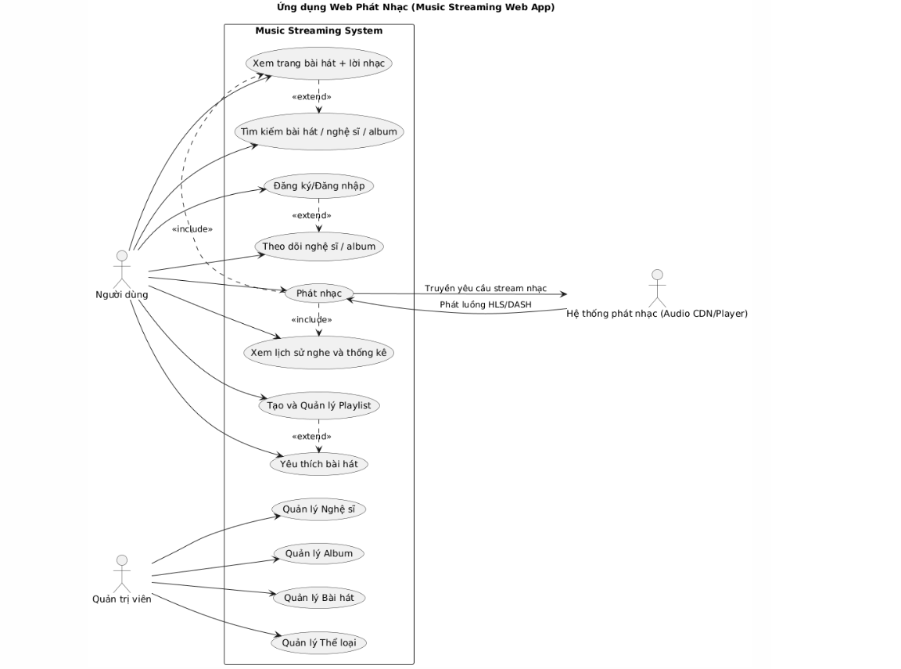
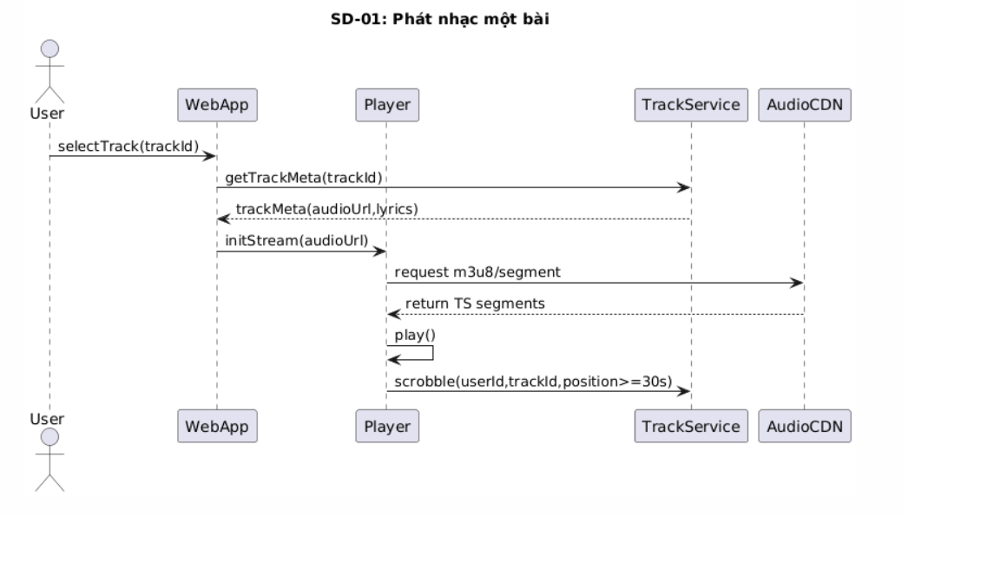
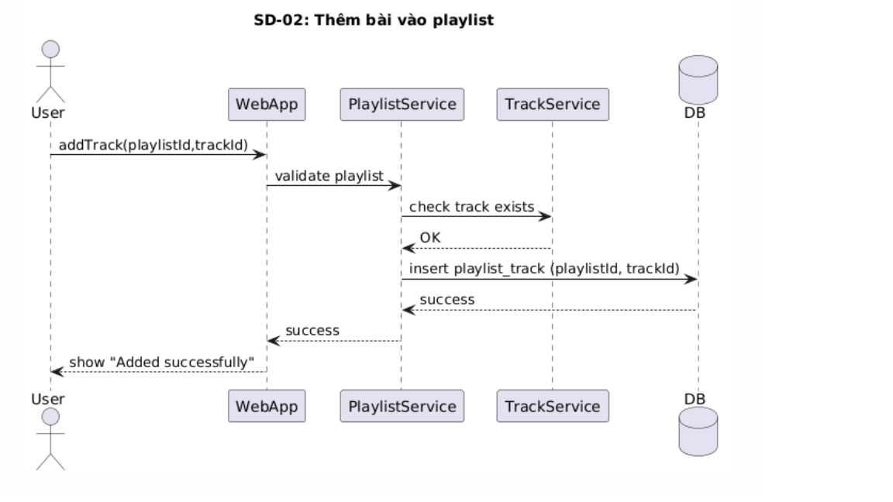
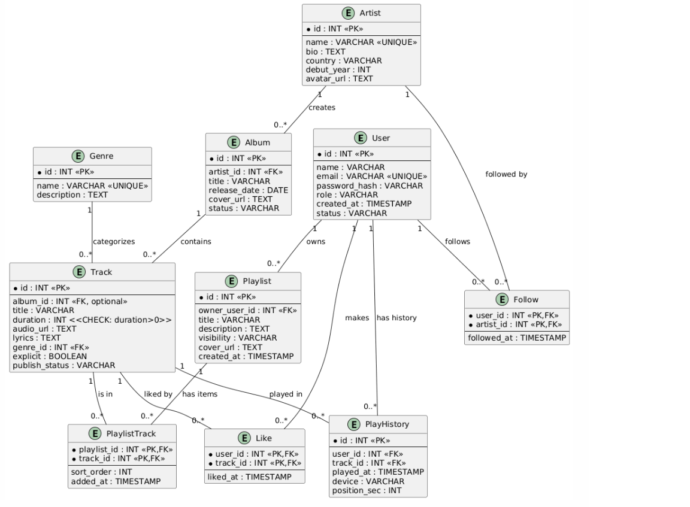
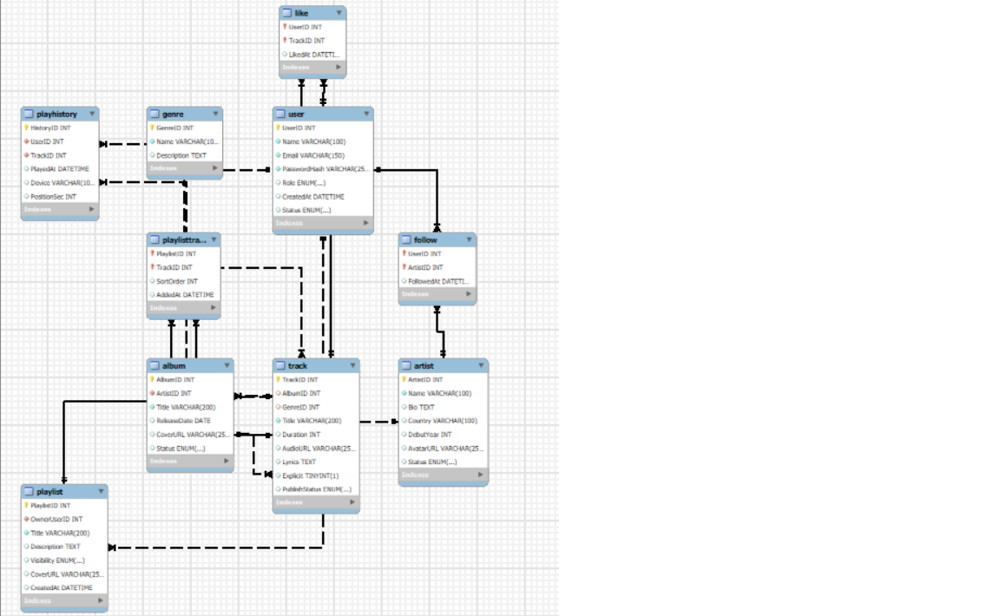

# 1. Sơ đồ Use Case Web phát nhạc
## Bảng mô tả chi tiết Use Case
| **STT** | **Tên Use Case**                                 | **Mô tả ngắn gọn**                                                      | **Tác nhân chính**  | **Điều kiện tiên quyết (Pre-condition)**           | **Kết quả (Post-condition)**                       | **Luồng sự kiện chính (Main Flow)**                                                                                                 |
| ------- | ------------------------------------------------ | ----------------------------------------------------------------------- | ------------------- | -------------------------------------------------- | -------------------------------------------------- | ----------------------------------------------------------------------------------------------------------------------------------- |
| 1       | **Đăng ký/Đăng nhập**                            | Cho phép người dùng tạo tài khoản mới hoặc đăng nhập vào hệ thống.      | Người dùng          | Hệ thống hoạt động, có kết nối mạng.               | Người dùng được xác thực và truy cập vào hệ thống. | (1) Người dùng chọn “Đăng nhập/Đăng ký” → (2) Nhập thông tin → (3) Hệ thống kiểm tra → (4) Xác thực thành công → (5) Vào trang chủ. |
| 2       | **Tìm kiếm bài hát / nghệ sĩ / album**           | Người dùng nhập từ khóa để tìm nội dung mong muốn.                      | Người dùng          | Người dùng đã đăng nhập.                           | Hệ thống hiển thị danh sách kết quả phù hợp.       | (1) Người dùng nhập từ khóa → (2) Hệ thống xử lý tìm kiếm → (3) Hiển thị kết quả.                                                   |
| 3       | **Phát nhạc**                                    | Hệ thống phát bài hát do người dùng chọn.                               | Người dùng / Player | Người dùng đã chọn bài hát.                        | Bài hát phát thành công trên trình phát nhạc.      | (1) Người dùng chọn bài hát → (2) Hệ thống gửi yêu cầu phát → (3) Player stream nhạc → (4) Ghi lại lịch sử nghe.                    |
| 4       | **Xem trang bài hát + lời nhạc**                 | Hiển thị thông tin chi tiết về bài hát, bao gồm lời và nghệ sĩ.         | Người dùng          | Bài hát đã được chọn.                              | Trang bài hát hiển thị thông tin đầy đủ.           | (1) Người dùng mở bài hát → (2) Hệ thống truy xuất dữ liệu → (3) Hiển thị thông tin và lời nhạc.                                    |
| 5       | **Tạo và Quản lý Playlist**                      | Người dùng có thể tạo, chỉnh sửa, hoặc xóa playlist cá nhân.            | Người dùng          | Đã đăng nhập.                                      | Playlist được cập nhật hoặc lưu mới.               | (1) Chọn “Tạo playlist mới” → (2) Nhập tên, chọn bài hát → (3) Lưu playlist → (4) Hệ thống xác nhận thành công.                     |
| 6       | **Yêu thích bài hát**                            | Người dùng đánh dấu bài hát yêu thích để nghe lại.                      | Người dùng          | Đã đăng nhập.                                      | Danh sách yêu thích được cập nhật.                 | (1) Nhấn biểu tượng “❤” → (2) Hệ thống lưu vào danh sách yêu thích → (3) Hiển thị trạng thái đã lưu.                                |
| 7       | **Theo dõi nghệ sĩ / album**                     | Người dùng có thể theo dõi nghệ sĩ để nhận cập nhật mới.                | Người dùng          | Đã đăng nhập.                                      | Nghệ sĩ được thêm vào danh sách theo dõi.          | (1) Chọn “Theo dõi” → (2) Hệ thống xác nhận → (3) Cập nhật danh sách người theo dõi.                                                |
| 8       | **Xem lịch sử nghe và thống kê**                 | Hệ thống lưu lại lịch sử nghe nhạc và hiển thị thống kê cho người dùng. | Người dùng          | Người dùng đã có hoạt động nghe nhạc.              | Hiển thị danh sách lịch sử và biểu đồ thống kê.    | (1) Người dùng chọn “Lịch sử nghe” → (2) Hệ thống truy xuất dữ liệu → (3) Hiển thị danh sách và thống kê.                           |
| 9       | **Quản lý Nghệ sĩ / Album / Bài hát / Thể loại** | Quản trị viên thêm, chỉnh sửa hoặc xóa thông tin nhạc.                  | Quản trị viên       | Quản trị viên đã đăng nhập vào giao diện quản trị. | Dữ liệu hệ thống được cập nhật.                    | (1) Admin chọn danh mục → (2) Thêm/Sửa/Xóa thông tin → (3) Hệ thống xác nhận cập nhật thành công.                                   |

# 2.Sơ đồ tuần tự (Sequence Diagram)

# 3. Sơ đồ ER và ERD
## Mô tả ER và ERD
### Thuộc tính quan trọng & ràng buộc

| Bảng (Table) | Cột | Kiểu dữ liệu gợi ý (PostgreSQL) | Khóa | Ràng buộc (Constraint/Index) |
| :--- | :--- | :--- | :--- | :--- |
| **User** | UserID, Email, PasswordHash, DisplayName | SERIAL/UUID | PK | **UNIQUE** (**User.Email**) |
| **Artist** | ArtistID, Name | SERIAL/UUID | PK | **INDEX** (**Artist.Name**) |
| **Album** | AlbumID, Title, **ArtistID** (FK) | SERIAL/UUID | PK | UNIQUE (Title, ArtistID) |
| **Track** | TrackID, Title, **Duration**, **AlbumID** (FK), **GenreID** (FK), StreamURL_HLS | SERIAL/UUID | PK | **INDEX** (**Track.Title**), **CHECK** (**Track.Duration** > 0) |
| **Playlist** | PlaylistID, Title, **OwnerID** (FK) | SERIAL/UUID | PK | FK ON DELETE CASCADE (với OwnerID) |
| **PlaylistTrack**| PlaylistID, TrackID, **SortOrder** | UUID/INT | **PK Tổng hợp** | **FK ON DELETE CASCADE** |
| **Like** | UserID, TrackID | UUID/INT | **PK Tổng hợp** | **FK ON DELETE CASCADE** |
| **Follow** | UserID, ArtistID | UUID/INT | **PK Tổng hợp** | **FK ON DELETE CASCADE** |
| **ListenHistory**| HistoryID, UserID (FK), TrackID (FK), ListenTime | SERIAL/UUID | PK | |

### Cardinality chính (giải thích nhanh)

- User (1) — Playlist (N) : một user có nhiều playlist.

- Playlist (1) — PlaylistTrack (N) ; Track (1) — PlaylistTrack (N) → vì Playlist ↔ Track là N–N, dùng PlaylistTrack.

- User (1) — Like (N) ; Track (1) — Like (N) → Like là N–N qua bảng Like.

- User (1) — Follow (N) ; Artist (1) — Follow (N) → Follow là N–N qua bảng Follow.

- Artist (1) — Album (N) : 1 artist nhiều album.

- Album (1) — Track (N) : 1 album nhiều track (nhưng track.album_id có thể NULL nếu single => optional).

- Genre (1) — Track (N) : mỗi bài có 1 thể loại.

- User (1) — PlayHistory (N) ; Track (1) — PlayHistory (N) : lịch sử nhiều bản ghi.

#### Dưới đây là ví dụ mapping cho các quan hệ chính:

- Playlist.owner_user_id → FK users.id (1 user có N playlist). SQL:
owner_user_id INT REFERENCES users(id) ON DELETE CASCADE

- PlaylistTrack(playlist_id, track_id):

PK: (playlist_id, track_id) (ngăn duplicate)

FKs: playlist_id → playlists.id ON DELETE CASCADE; track_id → tracks.id ON DELETE CASCADE

- Like(user_id, track_id):

PK (user_id, track_id)

FK user_id → users.id, track_id → tracks.id

- Follow(user_id, artist_id):

PK (user_id, artist_id)

FK user_id → users.id, artist_id → artists.id

- Album.artist_id → artists.id (1 artist → N album).

- Track.album_id → albums.id (optional) và Track.genre_id → genres.id.

- PlayHistory.user_id → users.id, PlayHistory.track_id → tracks.id.

### Tùy chọn hiện thực và ràng buộc

- Unique constraints: users.email, artists.name, genres.name. Ghi trong ERD 

- Check constraints: tracks.duration > 0 (DB-level CHECK).

- Referential actions: theo đề bài, dùng ON DELETE CASCADE cho bảng nối (PlaylistTrack, Like, Follow) → khi xóa user/playlist/track → xóa luôn các bản ghi liên quan.

#### Ví dụ mô tả 1 quan hệ (để chèn vào báo cáo)

- Playlist ↔ Track (N–N)
Mối quan hệ này là N–N: một playlist có nhiều track; một track có thể xuất hiện trong nhiều playlist. Vì vậy ta sử dụng bảng nối playlist_tracks với PK tổng hợp (playlist_id, track_id). Bảng này chứa thêm sort_order để lưu vị trí bài trong playlist và added_at. FK có ON DELETE CASCADE để khi xóa playlist/track, bản ghi tương ứng bị xoá.

## Bảng mô tả API endpoints
| Method      |                                                        Path | Mô tả                             |       |          |          |
| ----------- | ----------------------------------------------------------: | --------------------------------- | ----- | -------- | -------- |
| POST        |                                              /auth/register | Đăng ký (email/pass)              |       |          |          |
| POST        |                                                 /auth/login | Đăng nhập (token)                 |       |          |          |
| POST        |                                                   /auth/otp | Gửi/verify OTP                    |       |          |          |
| GET         |                                       /search?q=&type=track | artist                            | album | playlist | Tìm kiếm |
| GET         |                                                /tracks/{id} | Lấy metadata + lyrics             |       |          |          |
| GET         |                                         /tracks/{id}/stream | Trả streaming URL (m3u8 hoặc mp3) |       |          |          |
| POST        |                                           /tracks/{id}/play | Scrobble/play event               |       |          |          |
| POST        |                                                  /playlists | Tạo playlist                      |       |          |          |
| PUT         |                                             /playlists/{id} | Sửa playlist                      |       |          |          |
| POST        |                                      /playlists/{id}/tracks | Thêm track                        |       |          |          |
| DELETE      |                            /playlists/{id}/tracks/{trackId} | Xoá track                         |       |          |          |
| POST        |                                           /tracks/{id}/like | Like/unlike                       |       |          |          |
| POST        |                                        /artists/{id}/follow | Follow/unfollow                   |       |          |          |
| Admin: CRUD | /admin/artists, /admin/albums, /admin/tracks, /admin/genres | Admin endpoints (auth role)       |       |          |          |

## Business rules

- Một track chỉ xuất hiện một lần trong một playlist (enforced by PK on playlist_tracks).
- Lịch sử nghe được ghi khi play >= 30s hoặc user pressed next after ≥30s.
- Like toggle: duplicate likes không được phép (composite PK).
- Xoá user → xoá cascade playlist, likes, follows, playlist_tracks (FK ON DELETE CASCADE).
- Track.duration > 0 (CHECK).

